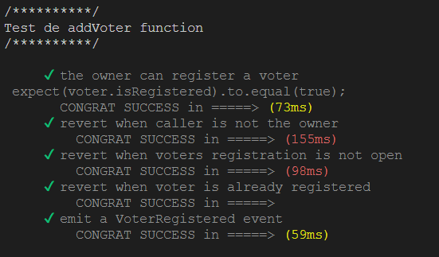
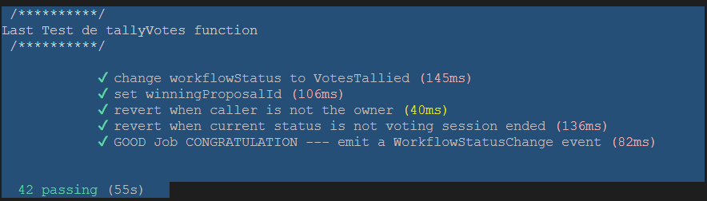

## Mise en place et réalisation de test expect & expectrevert & event / emit

Le scénario de test a été construit chronologiquement afin de réutiliser au maximum toutes les données.

Couvrons les fonctions suivantes dans le contrat intelligent :

## 8 functions
- addVoter
- addProposal
- setVote
- startProposalsRegistering
- endProposalsRegistering
- startVotingSession
- endVotingSession
- tallyVotes

Dans chaque cas, la fonction devrait fonctionner et vérifier les modifications dans le stockage. Les tests appellent également tous les modificateurs implémentés dans les fonctions ci-dessous.
expect() / expectRevert() / 
"" ***************************
Tous les événements émis dans le smart contract font l'objet de tests, qui incluent :
## 4 events
- VoterRegistered
- WorkflowStatusChange
- ProposalRegistered
- Voted

## Exemple du :
 /**********/
 Test de addVoter function 1 expect() / 3 expectRevert() / 1 Emit/Event()
 /**********/

      ✔ the owner can register a voter 
  expect(voter.isRegistered).to.equal(true);
        CONGRAT SUCCESS in =====> (73ms)
      ✔ revert when caller is not the owner 
          CONGRAT SUCCESS in =====> (155ms)
      ✔ revert when voters registration is not open 
          CONGRAT SUCCESS in =====> (98ms)
      ✔ revert when voter is already registered 
          CONGRAT SUCCESS in =====>
      ✔ emit a VoterRegistered event 
          CONGRAT SUCCESS in =====> (59ms)

## Premier Test

Test de la function addVoter



## FIN

Fin du test Voting.js


##Pour tester ce projet:
git clone https://github.com/egearbox/Projet2-BIS.git
npm init
// si besoin $ npm install dotenv @truffle/hdwallet-provider @openzeppelin/test-helpers @openzeppelin/contracts
truffle init
truffle compile
ganache // sinon pas de blockchain en locale 
truffle deploy
truffle migrate //all inclusively
et voilou un smart contract de vote test deployer avec des outils simple is the best ...merci a vous....

### truffle a la console (cela sonne recette de cuisine, non ?)
First, you have to run ganache in a separated console.// séparez un truc de la console remuez et votre ganache est prêted

```console
$  ganache-cli // or ganache
```

Then, you can use truffle to run the test located in the `/test` folder using

```console
$ truffle test // or truffle test test/Test_Voting.js
```