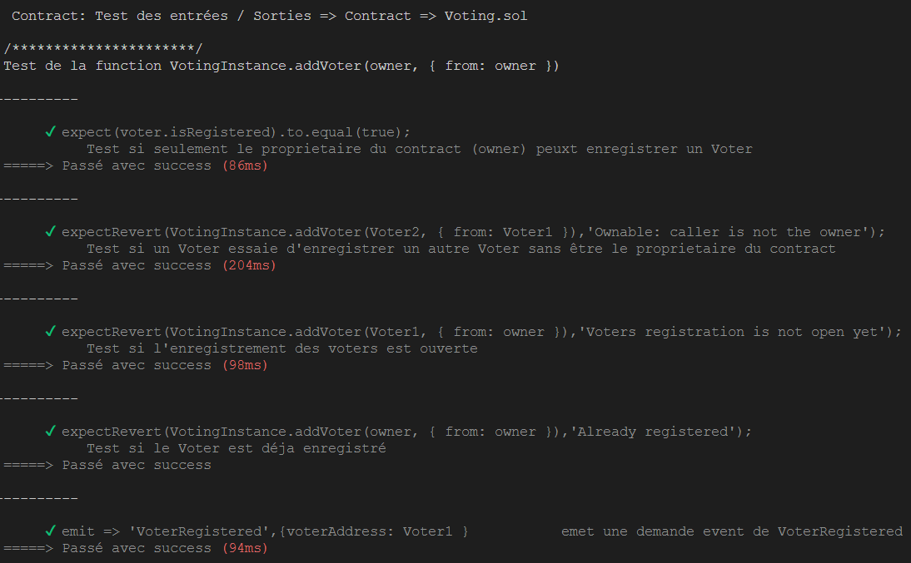

## Note

Test scenario was built chronologically in order to reuse every data as much as possible.

To do that, `describe` are used to cover the following functions in the smart contract :

- addVoter
- addProposal
- setVote
- startProposalsRegistering
- endProposalsRegistering
- startVotingSession
- endVotingSession
- tallyVotes

In each case, tests run cases where the function should work and verify modifications in the storage. Tests also call every modifiers and requires implemented in the functions below.

All the events emitted in the smart contract are covered by tests, which include :

- VoterRegistered
- WorkflowStatusChange
- ProposalRegistered
- Voted

## How to run tests

### Using truffle

First, you have to run ganache in a separated console.

```console
$  ganache-cli
```

Then, you can use truffle to run the test located in the `/test` folder using

```console
$ truffle test test/Voting.test.js
```

## Gas

Test de la function addVoter



## Coverage

Coverage measured with Hardhat and solidity-coverage

